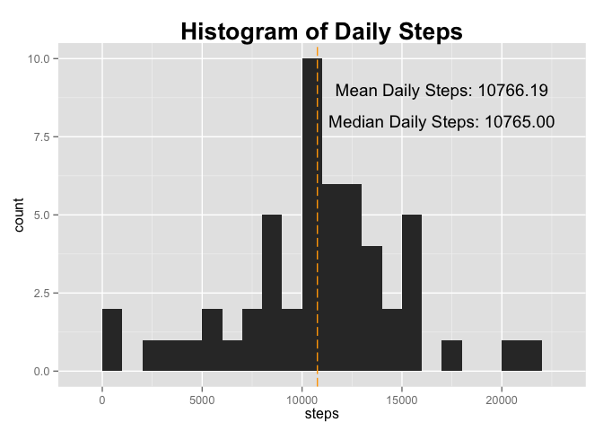
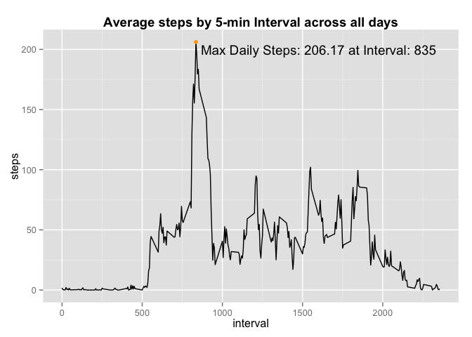
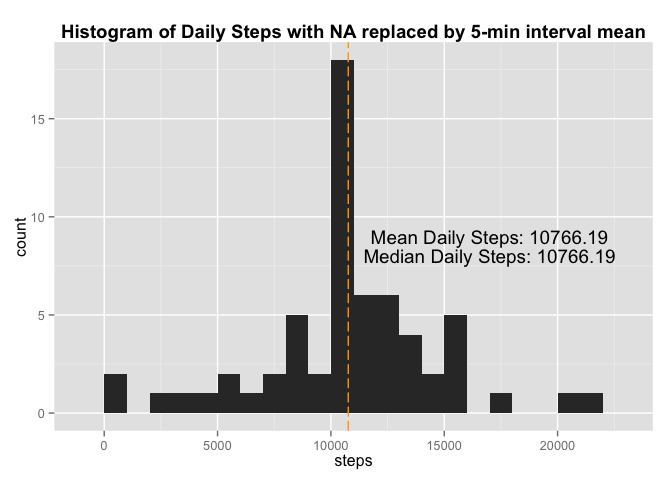
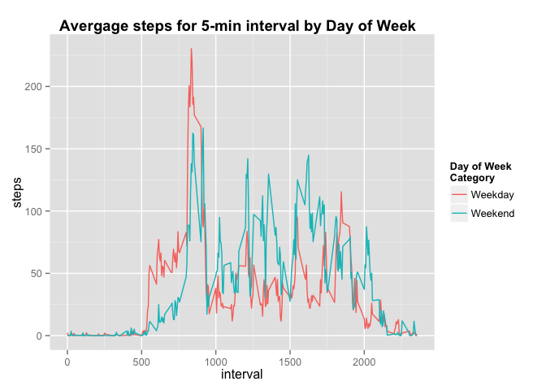

# Reproducible Research: Peer Assessment 1
A Katz  
# Overview

This assignment makes use of data from a personal activity monitoring device. This device collects data at 5 minute intervals through out the day. The data consists of two months of data from an anonymous individual collected during the months of October and November, 2012 and include the number of steps taken in 5 minute intervals each day.

# Data Description

The data for this assignment can be downloaded from the course web site:

* Dataset: [Activity monitoring data](https://d396qusza40orc.cloudfront.net/repdata%2Fdata%2Factivity.zip).  This data was last accessed 2/1/2016.

The variables included in this dataset are:

* steps: Number of steps taking in a 5-minute interval (missing values are coded as 𝙽𝙰)
* date: The date on which the measurement was taken in YYYY-MM-DD format
* interval: Identifier for the 5-minute interval in which measurement was taken

The dataset is stored in a comma-separated-value (CSV) file and there are a total of 17,568 observations in this dataset.

# Analysis

## Loading Libraries
In addition the the standard libraries, we are using the following:

ggplot2 - the Grammar of Graphics library for plotting


```r
library(ggplot2)
```

## Loading and preprocessing the data

The data is contained in file "activity.zip", which contains a single csv file "activity.csv".
The data can be loaded directly into R, no additional preprocessing beyond file extraction
is necessary.


```r
unzip("activity.zip")
DAT <- read.csv("activity.csv")
```

## What is mean total number of steps taken per day?

By summing all of the step measurements by day, we find that the mean number of steps
taken daily is 10766.19, and the median number of steps taken daily is 10765.


```r
STEPS_BY_DATE <- aggregate(steps ~ date, data=DAT, FUN="sum")

M <- mean(STEPS_BY_DATE$steps,na.rm=TRUE)
MD <- median(STEPS_BY_DATE$steps,na.rm=TRUE)
ggplot(STEPS_BY_DATE,aes(x=steps)) + 
  geom_histogram(binwidth=1000) +
  ggtitle("Histogram of Daily Steps") +
  theme(plot.title=element_text(face="bold", size=20)) +
  geom_vline(xintercept=M, col="orange", linetype="longdash") +
  annotate("text",label=sprintf("Mean Daily Steps: %0.2f",M), x=17000, y=9) +
  annotate("text",label=sprintf("Median Daily Steps: %0.2f",MD), x=17000, y=8)
```



## What is the average daily activity pattern?

Across all days, interval 835 contains the maximum average number of steps at 206.17.


```r
AVG_5_MIN_INT <- aggregate( steps ~ interval, data=DAT, FUN=mean)

MAX_STEP_ROW <- AVG_5_MIN_INT[ which.max(AVG_5_MIN_INT$steps), ]

ggplot(AVG_5_MIN_INT,aes(x=interval,y=steps)) +
  geom_line() + 
  ggtitle("Average steps by 5-min Interval across all days") +
  theme(plot.title=element_text(face="bold", size=14)) + 
  geom_point(aes(x=interval,y=steps),data=MAX_STEP_ROW, col="orange") +
  annotate("text",label=sprintf("Max Daily Steps: %0.2f at Interval: %0.0f",MAX_STEP_ROW$steps, MAX_STEP_ROW$interval), x=1600, y=200) 
```



## Imputing missing values

```r
DAT2 <- DAT

# Compute the number of missing elements
NUM_NA <- sum(is.na(DAT2$steps))

# Replace the missing rows with the average of each interval

# we need to create a function that we can apply to each element
fill_steps <- function(steps, interval) {
  retval <- steps
  if( is.na(steps) ) {
    retval <- AVG_5_MIN_INT[ AVG_5_MIN_INT$interval == interval, "steps" ]
  }
  return( retval )
}

# apply the na filling function to all elements
DAT2$steps <- mapply(fill_steps, DAT2$steps, DAT2$interval)

STEPS_BY_DATE2 <- aggregate(steps ~ date, data=DAT2, FUN="sum")
M2 <- mean(STEPS_BY_DATE2$steps )
MD2 <- median(STEPS_BY_DATE2$steps )
ggplot(STEPS_BY_DATE2,aes(x=steps)) + 
  geom_histogram(binwidth=1000) +
  ggtitle("Histogram of Daily Steps with NA replaced by 5-min interval mean") +
  theme(plot.title=element_text(face="bold", size=14)) +
  geom_vline(xintercept=M2, col="orange", linetype="longdash") +
  annotate("text",label=sprintf("Mean Daily Steps: %0.2f",M2), x=17000, y=9) +
  annotate("text",label=sprintf("Median Daily Steps: %0.2f",MD2), x=17000, y=8)
```



## Are there differences in activity patterns between weekdays and weekends?

```r
# Label each aggregated record as weekday or weekend
DAT2$dayofweek <- weekdays( as.Date( DAT2$date ) )
DAT2$dow_cat <- ifelse( (DAT2$dayofweek %in% c("Saturday","Sunday")), "Weekend", "Weekday")
DAT2$dow_cat <- factor( DAT2$dow_cat )

STEPS_BY_DOW_CAT <- aggregate(steps ~ interval + dow_cat, data=DAT2, FUN="mean")

ggplot( STEPS_BY_DOW_CAT, aes( x=interval, y=steps, group=dow_cat ) ) +
  geom_line( aes(colour=dow_cat) ) +
  ggtitle("Avergage steps for 5-min interval by Day of Week  ") +
  theme(plot.title=element_text(face="bold", size=14)) +
  scale_colour_discrete(name="Day of Week\nCategory")
```


